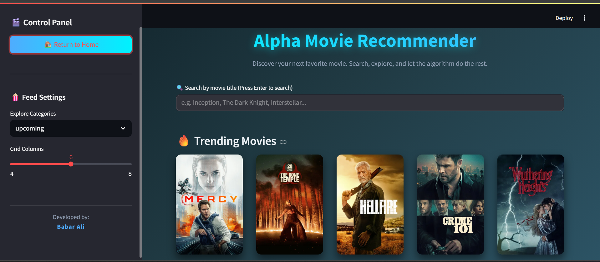

# Alpha AI Movie Recommender System 🎬

**Developed by:** Babar Ali  
**NLP** | **Python | Streamlit | AI Hybrid Recommender**

---

##  Project Overview

Alpha AI Movie Recommender System is a **modern AI-powered movie discovery platform**.  
It uses a **hybrid recommendation engine (TF-IDF + Genre)** to provide **personalized movie suggestions**, trending movies, and detailed movie information — all in a **premium, interactive Streamlit UI**. 

**Live Demo** https://alpha-ai-movie-recommender-system.streamlit.app/

---

## Features

-  **Smart Search** – Find movies by title keyword with instant suggestions  
-  **Home Feed** – Browse trending, popular, top-rated, upcoming, and now-playing movies  
- 🌟 **AI Recommendations** – Get TF-IDF based similar movies and genre-based suggestions  
-  **Movie Details** – Posters, release date, overview, and genres  
-  **Premium UI** – Glassmorphism cards, gradient hero, hover effects, and interactive layout  
-  **Fast & Lightweight** – Built with Python and Streamlit  
---

##  Screenshot

### Home Page
  
 

>

---

##  Tech Stack

- **Frontend:** Streamlit  
- **Backend API:** FastAPI / TMDB API (or your deployed API)  
- **Recommendation Engine:** TF-IDF + Genre Hybrid  
- **Programming Language:** Python 3.10+  
- **Deployment:** Streamlit Cloud / GitHub  

---

